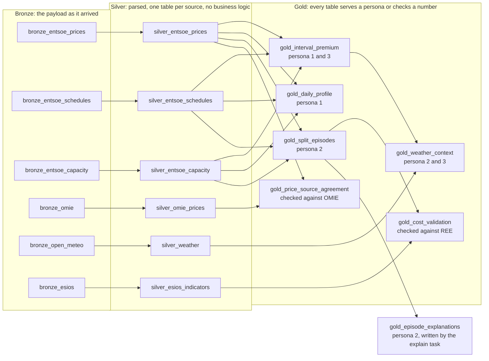

# How to run this

Two environments, and the same code in both. Locally the medallion is parquet
on disk, on Databricks it is Delta in Unity Catalog built by a Lakeflow
declarative pipeline. The ingestion, parsing and analysis functions are the
same objects in both cases, which is what makes the numbers comparable.

Start here for the local loop, which is where development happens, then
[Databricks](#on-databricks) for the platform.

- [Where everything lives](#where-everything-lives)
- [The mental model](#the-mental-model)
- [Locally](#locally)
- [The dashboard](#the-dashboard)
- [On Databricks](#on-databricks)
- [The daily Job](#the-daily-job)
- [Continuous integration](#continuous-integration)
- [Tracing and experiments](#tracing-and-experiments)
- [The evaluation set](#the-evaluation-set)
- [Running the agent](#running-the-agent)
- [Things worth breaking on purpose](#things-worth-breaking-on-purpose)
- [Changing the analysis](#changing-the-analysis)

## Where everything lives

Four places, and which one a file belongs in is decided by what it is allowed to
import rather than by what it is about.

| Folder | What it is | May import |
|---|---|---|
| `src/iberian/` | the library | standard library, pandas, requests. No Databricks, no Spark |
| `pipelines/` | notebooks and the declarative pipeline | `src/iberian/`, plus Spark and dbutils |
| `scripts/` | entry points you run at a terminal | `src/iberian/` |
| `app/` | the web service | nothing from `src/iberian/`: it serves a built file |

That rule is what keeps the test suite at two seconds. The moment a Databricks
import appears under `src/iberian/`, every test needs a cluster to run.

```
src/iberian/
  config.py  market_time.py        settings, and the Iberian market day
  ingestion/                       API clients, one per source
  parsing/                         payloads to tidy rows
  analysis/                        pure functions on dataframes
  pipeline/                        gold table builders, dedupe
  agent/
    facts.py                       retrieved evidence, as sourced facts
    verify.py                      rejects any figure that was not retrieved
    explain.py                     the generate, check, retry once loop
    tracing.py                     MLflow's decorator, or a no-op without it
    experiment.py                  an evaluation run, as an MLflow run
    batch.py                       which episodes need explaining, and merging
    table.py                       the explanations as a typed, commented table
  publish/
    dashboard.py                   gold tables to the published JSON
    github.py                      commit a built file over the contents API

agents/
  mibel_agent.py                   the agent as an MLflow ResponsesAgent

pipelines/
  01_build_medallion.py            ingest task: APIs to the Volume
  02_explain_episodes.py           explain task: new episodes to the Volume
  03_publish_dashboard.py          publish task: gold to a commit
  transformations/                 the declarative pipeline, 18 tables

app/
  main.py                          FastAPI: the dashboard and the OAuth flow
  public/index.html                the page
  public/data.json                 written by the Job, not by hand

scripts/                           every entry point, see the sections below
tests/                             synthetic data, no network, no credentials
resources/iberian_job.yml          the daily Job
databricks.yml                     the Asset Bundle
.github/workflows/ci.yml           tests and checks on every push
```

### The two MLflow files, and why they are library code

`agent/tracing.py` and `agent/experiment.py` sit under `src/iberian/` rather
than in `scripts/`, which looks wrong at first because MLflow is a platform
thing.

They are there because the agent uses them. `facts.py`, `verify.py` and
`explain.py` are decorated by `tracing.trace`, so it has to be importable
wherever they are. `experiment.py` is used by `scripts/explain_episodes.py` and
could have lived there, but then a notebook that wanted to record a run would
have to import from a scripts directory, which is the shape that cost three
failed Job runs already.

Neither breaks the no-platform-imports rule, because neither imports MLflow at
module level. They try, and carry on without it. Run the suite on a machine that
has never installed MLflow and it passes; install it and three extra tests start
running against the real decorator.

---

## The mental model

Five layers, and each one is worth poking at separately.

**Raw** holds API payloads byte for byte, exactly as they arrived. Nothing is
interpreted. If a parser turns out to be wrong, this is what gets reprocessed
instead of re-hitting a rate limited API. Locally it is `data/raw/`, on
Databricks a Unity Catalog Volume with the same directory layout, which is why
a local backfill can be copied up and read without translation.

**Bronze** exists only on Databricks: a streaming table over the Volume, read as
`binaryFile`, so the payload is stored exactly as it arrived and Auto Loader
tracks which files it has already seen.

**Silver** is those payloads parsed into tidy rows, one table per source, no
business logic applied.

**Gold** is the three persona tables, plus weather context and the two
validations.

**The analysis modules** (`src/iberian/analysis/`) are pure functions on
dataframes. No network, no credentials, no Databricks.

**The agent** (`src/iberian/agent/`) assembles retrieved facts, asks a model to
phrase them, and rejects the answer if it contains a figure that was not
retrieved. Only the model call touches a network.

---

## Locally

```bash
cd ~/repos/iberian-energy
source .venv/bin/activate
export $(grep -v '^#' .env | xargs)
```

### Start here

```bash
python -m pytest tests/ -q          # 269 tests, no network, under three seconds
python scripts/run_market_splitting.py --demo   # whole pipeline, synthetic data
python scripts/explore.py tables    # what the last run produced
```

The demo plants two known splits in a synthetic week, so the detection is
verifiable by eye before trusting it on real data.

### Building the medallion

```bash
# One market day, cheap
python scripts/build_medallion.py --start 2026-09-03 --days 1

# A month, for a daily profile that actually means something
python scripts/build_medallion.py --start 2026-08-01 --days 31

# Recompute gold from the silver already on disk, no API calls at all
python scripts/build_medallion.py --from-silver

# Skip a source to see the pipeline degrade gracefully
python scripts/build_medallion.py --start 2026-09-03 --days 1 --skip-weather
```

`--from-silver` is the one to use after changing anything in `analysis/` or
`pipeline/gold.py`. It runs the same `build_gold()` the full pipeline runs, so
there is no second code path that can drift from the first.

Seven days is not enough to tell a manufacturer when to run equipment. Thirty
is a minimum, sixty is better. That run costs nothing but time.

### Exploring what it built

```bash
python scripts/explore.py profile              # persona 1: when does PT pay?
python scripts/explore.py episodes             # persona 2: duration, cause, cost
python scripts/explore.py day --date 2026-09-03    # just the splits that day
python scripts/explore.py day --date 2026-09-03 --all   # every interval
python scripts/explore.py weather              # does solar move the ES price?
python scripts/explore.py compare              # ENTSO-E against OMIE
```

`explore.py weather` reports two numbers per location: the raw correlation and
the same correlation computed within each hour of the day. They disagree badly,
and the second is the one to believe. See [the weather result](#the-weather-result-and-why-the-obvious-version-was-wrong).

### Investigating one number

These take a real question and answer it with sourced figures.

```bash
# Why did Portugal pay 28 EUR/MWh more at this moment?
python scripts/explain_interval.py --at 2026-09-03T18:00

# Show the leak the point in time filter prevents
python scripts/explain_interval.py --at 2026-09-03T18:00 --no-point-in-time

# The capacity curve, hour by hour, with splits marked
python scripts/show_capacity.py --start 2026-09-03 --days 2

# Prices side by side around an episode, from already landed XML
python scripts/show_window.py --from 2026-09-03T16:30 --to 2026-09-03T19:00

# Does a full border explain the splits, across a range?
python scripts/analyse_saturation.py --start 2026-09-01 --days 7 --show-splits

# The cost figure against REE's published congestion rent
python scripts/check_congestion_rent.py --start 2026-07-01 --days 60
```

The last one is now also a gold table, `gold_cost_validation`. The script
remains useful for a quick answer without a cluster.

### Poking at the tables directly

```python
import pandas as pd
pd.set_option("display.width", 200)

g = pd.read_parquet("data/lakehouse/gold/gold_interval_premium.parquet")

g[g.is_decoupled][["ts_utc", "premium_eur_mwh", "utilisation"]]
g.groupby("market_day").is_decoupled.sum()
g.groupby("hour_of_day_utc").premium_eur_mwh.mean().sort_values()

# Splits that saturation does NOT explain, which are the interesting ones
g[(g.is_decoupled) & (~g.is_saturated.fillna(False))]
```

That last query is the one to keep an eye on. Every row in it is a split the
current story does not account for, and the pattern in them is where the next
real result lives.

---

## The dashboard

The page all three target users get, with no sign in. It is a single HTML file
and a single JSON file, so it needs no warehouse, no token and no call to REE at
request time.

```bash
pip install -r requirements-app.txt
python scripts/export_public_data.py
python -m uvicorn app.main:app --reload --port 8000
```

Then open `http://127.0.0.1:8000`.

`python -m uvicorn` rather than `uvicorn`. If the system package manager has
also installed uvicorn, the bare command runs the system Python and cannot see
anything in the virtual environment, which surfaces as `No module named
'fastapi'` while fastapi is plainly installed.

| Route | What it is |
|---|---|
| `/` | the dashboard |
| `/data.json` | the published gold data the page reads |
| `/auth` | Databricks sign in status, and the start of the OAuth flow |
| `/healthz` | liveness, and whether the data file is actually present |

`/healthz` reports the data file on purpose. A health check that only proves the
process is up reports green while the page renders empty.

### Where the data comes from

`scripts/export_public_data.py` reads the local Parquet build. The Job runs the
same builder against the Delta tables, through `iberian.publish.dashboard`, and
commits the result. Both produce the same document; only the source differs.

One difference between the two paths is deliberate. The local build does not
write the two validation tables, so on that path they are recomputed from silver
and from the stored ESIOS payloads. On Databricks the pipeline already owns them
as tables and they are read rather than recomputed. Either way the numbers come
out of the same functions in `iberian.analysis.validation`.

**The Job owns `app/public/data.json`.** Run the export locally to look at the
page, but discard it before committing, or a stale local build overwrites what
the Job published:

```bash
git checkout app/public/data.json
```

### On Render

| Setting | Value |
|---|---|
| Build command | `pip install -r requirements-app.txt` |
| Start command | `python -m uvicorn app.main:app --host 0.0.0.0 --port $PORT` |
| Health check path | `/healthz` |

`$PORT` and `--host 0.0.0.0` are both required: Render assigns the port and
stops a service that is not listening on it, and without the host it accepts
connections only from inside the container.

Environment variables are `DATABRICKS_HOST`, `DATABRICKS_REDIRECT_URI`,
`DATABRICKS_SCOPES`, `APP_OAUTH_CLIENT_ID` and `APP_OAUTH_CLIENT_SECRET`. The
last two are not called `DATABRICKS_CLIENT_ID` and `DATABRICKS_CLIENT_SECRET`
for the reason in the troubleshooting section below.

The free instance sleeps when idle. A sign in started before it restarted fails
with "unknown state", because the pending flow is held in memory; `/callback`
says so rather than blaming the user.

---

## On Databricks

Four pieces, in this order: a notebook that fetches and lands, a pipeline that
transforms, a notebook that explains, and a notebook that publishes. The first
writes no tables, the second makes no HTTP requests, the third calls a model and
writes neither tables nor payloads, and the fourth makes one authenticated HTTP
request and nothing else. None of those is an accident.

A declarative pipeline is given data and asked to derive tables from it. Putting
a rate limited API call inside a unit of work the platform is entitled to retry
would be a mistake. And a pipeline only manages tables it created, so a notebook
writing the same names both breaks the pipeline and gives two implementations of
one transformation.

### One time setup

**Secrets.** Both tokens live in a scope, never in a widget: a widget's value is
saved with the notebook state and this repository is public.

```bash
databricks secrets create-scope iberian
databricks secrets put-secret iberian entsoe_token
databricks secrets put-secret iberian esios_token
databricks secrets put-secret iberian github_token
```

Run each without flags and it opens an editor to paste into, which keeps the
value out of the shell history. `github_token` is a fine grained personal access
token scoped to this repository alone, with **Contents: Read and write** and
nothing else. GitHub adds **Metadata: Read-only** by itself, which is required
for any repository permission.

**Git folder.** Clone the repository into the workspace. The notebook and the
pipeline both import `src/iberian/` from it rather than carrying copies.

**The pipeline.** In **Jobs & Pipelines**, create an ETL pipeline with:

| Setting | Value |
|---|---|
| Source code | `pipelines/transformations` inside the Git folder |
| Default catalog and schema | where the tables should land |
| Configuration | `iberian.catalog`, `iberian.schema`, `iberian.raw_volume`, `iberian.src_path` |
| Compute | serverless |

`iberian.src_path` is the absolute path to `src/` in the Git folder. The file
tries `__file__` first and falls back to this, because `__file__` is not defined
in every execution context.

Keep `spark.sql.ansi.enabled` at `true`. It is what turned a stray reference
file in the landing zone into a visible error rather than a silent null.

### Running it

**1. Ingestion.** Open `pipelines/01_build_medallion.py`, set the widgets and
**Run all**.

```
catalog       bootcamp_students
schema        doriel
volume        raw
start_day     2026-07-16
days          65
secret_scope  iberian
```

It fetches ENTSO-E prices for both zones, the cross-border schedules and
capacity in both directions, the OMIE files, Open-Meteo for six locations and
four ESIOS indicators, and lands every payload in the Volume. Landing the same
window twice is safe.

**2. The pipeline.** **Dry run** first: it validates the code and the dependency
graph in seconds without writing anything, which catches an import or a schema
mistake before a cluster spends minutes on it. Then **Run pipeline**.

Auto Loader reads only the files it has not seen, so a daily run costs seconds.
Gold is recomputed in full, which at a few thousand rows also costs seconds.

**3. Explanations.** Open `pipelines/02_explain_episodes.py` and **Run all**. It
reads `gold_split_episodes`, works out which episodes have no explanation on
file, and calls the serving endpoint for those. Worst first, so if the cap bites
the explained ones are the ones anybody would have looked at first. Set the
`rebuild` widget to `yes` only to re-explain everything, which costs one model
call per episode.

It then writes `gold_episode_explanations`, overwritten in full from the JSONL
on every run. The file is the record of work and the table is a materialisation
of it, so if the two ever disagree the file is right. Every column carries a
comment, because a gold table a journalist or a grader is expected to query
should explain itself:

```sql
SELECT e.market_day, e.peak_spread, x.text
FROM   bootcamp_students.doriel.gold_split_episodes  e
JOIN   bootcamp_students.doriel.gold_episode_explanations x
  ON   x.episode_key = concat(e.market_day, 'T', date_format(e.start_utc, 'HHmm'))
WHERE  x.grounded
ORDER  BY e.peak_spread DESC
LIMIT  10;
```

**4. Publishing.** Open `pipelines/03_publish_dashboard.py` and **Run all**. It
reads the gold tables, builds the same JSON the local export builds, and commits
it to the branch. Render watches the branch, so the commit is the deploy.

It prints where it found the checkout before it imports anything, which is the
first thing to read if it fails:

```
Working directory: /Workspace/Repos/.internal/<id>_commits/<sha>/pipelines
Repo root:         /Workspace/Repos/.internal/<id>_commits/<sha>
```

If the data has not changed it prints `unchanged` and commits nothing. Set the
`force` widget to `yes` to commit anyway, which is worth doing once to prove the
token works and never on a schedule.

### The 18 tables

| Layer | Tables |
|---|---|
| Bronze | `bronze_entsoe_prices`, `bronze_entsoe_schedules`, `bronze_entsoe_capacity`, `bronze_omie`, `bronze_open_meteo`, `bronze_esios` |
| Silver | `silver_entsoe_prices`, `silver_entsoe_schedules`, `silver_entsoe_capacity`, `silver_omie_prices`, `silver_weather`, `silver_esios_indicators` |
| Gold | `gold_interval_premium`, `gold_daily_profile`, `gold_split_episodes`, `gold_weather_context`, `gold_price_source_agreement`, `gold_cost_validation` |

Plus `gold_episode_explanations`, which is written by the `explain` task rather
than by the pipeline, for the reason given in that notebook.



Three things the picture makes obvious that the table above does not.

**Bronze to silver is one to one.** Every source gets its own silver table and
no business logic happens on that hop, so a parsing bug is fixed by replaying
bronze rather than by re-fetching from a rate limited API.

**The first three gold views are siblings, not a chain.** `gold_interval_premium`,
`gold_daily_profile` and `gold_split_episodes` each read the same three silver
tables and compute all three results internally, returning one. That is what
keeps the interval premium, the daily profile and the episode boundaries
arithmetically consistent with each other.

**The two validations sit in gold on purpose.** `gold_price_source_agreement`
and `gold_cost_validation` are checks against publishers outside this project,
and they are tables recomputed on every run rather than scripts somebody
remembers to invoke.

### Checking it agrees with the local build

This is the check worth running after any change to the analysis, because it is
the one that proves moving the code did not move the numbers.

```sql
SELECT market_day,
       count(*) AS episodes,
       round(sum(extra_cost_eur)) AS eur,
       round(max(max_abs_spread), 2) AS worst_spread
FROM bootcamp_students.doriel.gold_split_episodes
GROUP BY 1 ORDER BY 1;
```

```bash
python - <<'EOF'
import pandas as pd
e = pd.read_parquet("data/lakehouse/gold/gold_split_episodes.parquet")
print(e.groupby("market_day")
       .agg(episodes=("episode_id", "count"),
            eur=("extra_cost_eur", lambda s: round(s.sum())),
            worst_spread=("max_abs_spread", lambda s: round(s.max(), 2)))
       .to_string())
EOF
```

Compare only the days present on both sides. They should match exactly. A one
euro difference on a day is rounding, not divergence: SQL rounds a half up and
Python rounds it to even, so a sum ending in `.5` differs by one. Check the
unrounded sum before chasing it.

### The two validations, as queries

```sql
-- Do the two publishers agree, interval by interval?
SELECT count(*) AS intervals,
       sum(CASE WHEN agrees THEN 1 ELSE 0 END) AS agreeing,
       round(max(pt_difference), 4) AS worst_pt_difference
FROM bootcamp_students.doriel.gold_price_source_agreement;

-- Does the cost figure match REE's published congestion rent?
SELECT round(sum(our_cost_eur)) AS ours,
       round(sum(congestion_rent_eur)) AS ree,
       round(100 * (sum(our_cost_eur) - sum(congestion_rent_eur))
                 / sum(congestion_rent_eur), 4) AS difference_pct
FROM bootcamp_students.doriel.gold_cost_validation;

-- The interesting rows: days REE recorded rent and this project found none
SELECT * FROM bootcamp_students.doriel.gold_cost_validation
WHERE episodes = 0 AND congestion_rent_eur > 0
ORDER BY congestion_rent_eur DESC;
```

### When something fails

**"MANAGED table already exists with that name."** A table of that name was
created outside the pipeline, usually by an older version of the notebook. The
pipeline only manages tables it created. Drop it and re-run: everything from
bronze onwards is derived from the bytes in the Volume, so nothing is lost.

**The gold tables fail with a timezone error.** Spark returns timestamps without
a timezone and the market day is found by converting to CET. `as_utc` handles
this at the boundary; if a new table skips it, this is the symptom.

**A stream fails on a cast.** Something is in the landing zone that is not a
response document. The ESIOS catalogue and the request metadata files are both
filtered out by name for this reason.

**The publish task cannot import `iberian`.** Read the `Repo root` line it
prints. The import block is a copy of the one in `01_build_medallion`, which
works, so a difference there is the thing to look at. Three runs were lost
inventing a second mechanism before copying the one that was already proven.

**The publish task says `unchanged`.** The data is the same as what is already
committed, ignoring the timestamp. Usually it means the export was run locally
and committed by hand. Set `force` to `yes` to override.

**The commit is rejected with a conflict.** Something else wrote to the same
path between the read and the write. Re-run; the next attempt reads the new sha.

**`git push` is rejected with "fetch first".** The Job committed the data file
to the branch. `git pull --rebase` then push. Running
`git config pull.rebase true` once in this repository makes that the default,
which matters because the Job commits every afternoon.

---

## The daily Job

`iberian-daily` runs four tasks in order at 16:00 Europe/Lisbon, which leaves
margin after the Iberian day-ahead results are published in the early
afternoon: `ingest`, `transform`, `explain`, `publish`.

`explain` is the one that is easy to miss and the one that makes the north star
metric a property of the system. It explains only episodes with no explanation
on file, capped at 25 per run, and writes to
`/Volumes/<catalog>/<schema>/<volume>/agent/explanations.jsonl`. It writes there
rather than to the repository because within a single run the Git checkout is
frozen at the commit the run started from, so a file this task committed would
be invisible to `publish` in the same run. The Volume is where the tasks of this
Job already hand things to each other.

The definition lives in `resources/iberian_job.yml` and is deployed with the
Asset Bundle. It was originally built by clicking, which is fine for finding out
what the settings are and wrong as the place to keep them, then bound to the
existing job id so the run history survived.

```bash
databricks bundle validate -t prod
databricks bundle deploy -t prod
databricks bundle run iberian_daily -t prod
```

Change the Job in the YAML, not in the interface. A bundle deployed Job is
marked as managed by the bundle and the workspace restricts editing it there;
either way an edit made by clicking is overwritten by the next deploy.

### What deploy does and does not do

**`bundle deploy` changes the Job definition only.** The schedule, the tasks,
the retries, the parameters.

**The code comes from the branch.** The Job is configured with `git_source`, so
each run takes its own snapshot into
`/Workspace/Repos/.internal/<id>_commits/<sha>`. A `git push` is therefore what
changes the code that runs in production.

**The workspace Git folder of the same repository is a different thing and no
task reads it.** Pulling it changes nothing about what the Job runs. This cost
three failed runs to establish, and the notebook now prints its own repo root so
the question can be settled in one line rather than by argument.

### Testing one task without the whole Job

`ingest` and `transform` take about four minutes together. When iterating on
`publish`, open the run in the UI and run that task alone rather than the Job.

### Trailing window, not one day

`ingest` asks for three market days ending today rather than one. ENTSO-E
republishes corrected documents, so a trailing window picks up a correction.
Landing a day twice is safe: `pipeline/dedupe.py` keeps the later publication.

---

## Continuous integration

`.github/workflows/ci.yml` runs on every push to `main` and on every pull
request. Everything in it is offline, with no credentials and no data on disk.

| Step | What it catches |
|---|---|
| `pytest -q` | the analysis, the parsers, the verifier, the publisher |
| `scripts/check_bundle_paths.py` | a `notebook_path` matching no file, or a `${var.x}` that is not declared |
| a clean install of `requirements-app.txt` | an import the app gained that was only ever installed as a side effect of the development requirements |

Commits to `app/public/data.json` do not trigger it. The Job writes that file
every afternoon, and running the suite because the market data changed says
nothing about the code.

**There is no deploy step, deliberately.** Personal access tokens are disabled
in this workspace and no service principal is available, so CI cannot
authenticate to Databricks at all. Given that `git push` is already what changes
the running code, what was actually missing was anything checking the code
first, and that is what this does. `bundle deploy` stays manual, and the things
it changes change rarely.

Run the checks locally the way CI does:

```bash
python -m pytest -q
python scripts/check_bundle_paths.py
```

---

## Tracing and experiments

Every evaluation run records itself. Nothing here is required to get the
numbers: without MLflow installed the run says so and carries on, which is why
`iberian/agent/tracing.py` exists at all.

### Recording locally needs the full MLflow, not the skinny one

`requirements.txt` pins `mlflow-skinny`, which is right for the Job: the
notebook environment wants the small package and the project only needs tracing
and logging there. Locally it is not enough. From MLflow 3.7 the default local
backend is SQLite rather than `./mlruns`, and the skinny package ships without
SQLAlchemy, so the database stores are never registered and a local run fails
with `unsupported URI 'sqlite:///.../mlflow.db'`. Install the full package in
the development environment and leave `requirements.txt` alone:

```bash
pip install mlflow                 # the full package, brings SQLAlchemy
```

This is a development dependency. Nothing in the Job needs it, and adding it to
`requirements.txt` would put a package into the Job environment for the sake of
a laptop.

```bash
# Local, recorded nowhere
python scripts/explain_episodes.py --limit 3 --labelled-only --no-mlflow

# Recorded in the workspace
python scripts/explain_episodes.py --limit 3 --labelled-only \
  --tracking-uri databricks
```

The run carries the endpoint, the attempt limit and the trace storage as
parameters, six metrics,
`evaluation/explanations.jsonl` as an artifact, and the failing episode keys as
a tag.

| Metric | Why it is there |
|---|---|
| `grounded_rate` | the north star, as a share so runs over different episode counts compare |
| `first_attempt_rate` | a retry is not a failure, but it is worse, and the final verdict hides it |
| `claims_per_explanation` | what stops the first metric being vacuous: 100% grounded over prose containing no figures is a perfect and meaningless score |
| `numeric_claims` | the raw count behind it |

Three spans appear per explanation: `episode_facts` as RETRIEVER,
`explain` as AGENT and `verify` as PARSER. Read those before reading the code
when an answer looks wrong, because the trace shows what each step actually
received rather than what it was supposed to receive.

### Unity Catalog trace storage does not work here

MLflow recommends storing traces in Unity Catalog Delta tables rather than in
the experiment. The flags exist:

```bash
export MLFLOW_TRACING_SQL_WAREHOUSE_ID=<a warehouse from `databricks warehouses list`>
python scripts/explain_episodes.py --limit 3 --labelled-only \
  --tracking-uri databricks \
  --experiment /Users/<you>/iberian-energy-agent-uc \
  --trace-catalog bootcamp_students --trace-schema doriel
```

It binds, it provisions all four `otel` tables, and it exports nothing. The
spans table stays at zero rows across runs with the warehouse both cold and
warm. No cause has been established. ROADMAP.md records what was observed.

**Use a new experiment name if you try it.** A Unity Catalog trace location is
permanent: once an experiment is bound it cannot be pointed elsewhere, so
binding the one you already use costs you that experiment.

Reading it back needs the SQL, not the API, because `search_traces` returned
nothing even when asked correctly:

```sql
SELECT count(*) FROM <catalog>.<schema>.`<experiment id>_otel_spans`;
```


---

## The evaluation set

The north star metric needs human labels. They cannot be generated, and in
particular they cannot be generated by the same system that produced the
candidate cause, because then the metric measures the project agreeing with
itself.

```bash
# Build the labelling sheet from the episodes in gold
python scripts/build_evaluation_set.py

# Label them one at a time, in the terminal
python scripts/label_episodes.py

# Only ten, then stop
python scripts/label_episodes.py --limit 10

# Revisit ones already labelled
python scripts/label_episodes.py --all
```

By default the episodes are interleaved across strata rather than ordered by
spread, so a partially labelled sheet is still representative. `--by-spread`
gives the largest first.

`evaluation/cause_vocabulary.md` holds the allowed causes and what each one
means. When the evidence does not settle it, `unclear` is a real answer and a
more useful one than a guess, because it is a class the agent must also be able
to produce.

All 48 episodes are labelled.

## Running the agent

The agent needs a Databricks serving endpoint, so this is the one local command
that authenticates to the workspace.

```bash
# Read the fact sheets without spending a token
python scripts/explain_episodes.py --dry-run --limit 5

# Run it for real
python scripts/explain_episodes.py --limit 5

# Only episodes a human has labelled, which is what the metric needs
python scripts/explain_episodes.py --labelled-only

# One episode, by key. Re-runs it even though it is already on file, because
# that is the only reason to name one. This is how a rejection gets diagnosed.
python scripts/explain_episodes.py --episode 2026-08-01T1100
python scripts/explain_episodes.py --episode 2026-08-01T1100 --dry-run

# A larger model, to test whether grounding or model size does the work
python scripts/explain_episodes.py --labelled-only \
  --endpoint databricks-claude-opus-4-5 \
  --out evaluation/explanations_opus.jsonl
```

By default only episodes with no explanation on file are run, because an
episode's evidence is fixed once its market day settles and re-explaining the
other hundred and twenty-three would spend model calls reproducing answers that
already exist. `--all` re-runs everything. Records are merged by episode key,
never overwritten wholesale: an early version of this script overwrote the file
and a `--limit 3` test run silently destroyed 45 explanations.

Output lands in `evaluation/explanations.jsonl`, one record per episode, with
the rejected drafts and the final failing draft kept. The rejections are the
interesting rows: if the verifier never rejects anything, either the model is
flawless or the check is weak, and that needs settling rather than assuming.

`--dry-run` still performs retrieval. Only the model call is skipped. A preview
that showed different facts from the real run would be worse than no preview.

### Reading the failures

```bash
python - <<'EOF'
import json, pathlib
for name in ["explanations.jsonl", "explanations_opus.jsonl"]:
    path = pathlib.Path("evaluation") / name
    if not path.exists():
        continue
    for line in path.open():
        record = json.loads(line)
        if record["grounded"]:
            continue
        print("=" * 70, f"\n{name}  {record['episode_key']}  {record['unsupported']}\n")
        print(record.get("final_draft") or record["rejected_drafts"][-1])
EOF
```

### If the SDK fails with `invalid_client`

The Databricks SDK reads `DATABRICKS_CLIENT_ID` and `DATABRICKS_CLIENT_SECRET`
from the environment and tries machine to machine auth with them, ignoring the
CLI profile. The app's OAuth credentials are named `APP_OAUTH_CLIENT_ID` and
`APP_OAUTH_CLIENT_SECRET` for exactly this reason. If an older `.env` still
exports the reserved names:

```bash
env -u DATABRICKS_CLIENT_ID -u DATABRICKS_CLIENT_SECRET \
  python scripts/explain_episodes.py --labelled-only
```

---

## Things worth breaking on purpose

The guards in this codebase exist because each one protects a number that would
otherwise be wrong in a way nobody notices. Watching them fire is the fastest
way to understand what they are for.

**Make the two zones disagree on resolution.**

```python
import sys; sys.path.insert(0, "src")
import pandas as pd
from iberian.analysis.market_splitting import build_spread_series
from iberian.config import EIC_PORTUGAL, EIC_SPAIN

rows = pd.DataFrame([
    {"zone_eic": EIC_PORTUGAL, "ts_utc": pd.Timestamp("2026-09-03T18:00Z"),
     "price_eur_mwh": 50.0, "resolution": "PT15M"},
    {"zone_eic": EIC_SPAIN, "ts_utc": pd.Timestamp("2026-09-03T18:00Z"),
     "price_eur_mwh": 50.0, "resolution": "PT60M"},
])
build_spread_series(rows, EIC_PORTUGAL, EIC_SPAIN)   # raises
```

Without that guard the pivot lines an hourly price up with the first quarter of
the hour and silently drops the other three.

**Feed it duplicate timestamps.** Duplicate the PT row above with a different
price and it refuses rather than picking one. That is the intraday contamination
hit early on, where one A44 document carried day-ahead and three intraday
auctions stacked on the same timestamps. It is also what fired the first time
the pipeline read the whole landing zone, which is what `pipeline/dedupe.py`
now resolves.

**Give `to_market_day` a naive timestamp.**

```python
import pandas as pd
from iberian.market_time import to_market_day
to_market_day(pd.Timestamp("2026-08-18 23:30:00"))   # raises
```

It has to. The market day begins at local midnight, so assuming a timezone here
would move every boundary by an hour or two and nothing would complain.

**Change the settlement interval.** In `detect_episodes`, pass
`step=pd.Timedelta(hours=1)` against quarter hourly data and watch every
duration inflate by four while separate episodes merge into one. That was a real
bug, and the arithmetic is now inferred from the data instead.

**Move the market day boundary.** Edit `MARKET_TIMEZONE` in `config.py` to
`"UTC"` and re-run `cross_check_prices.py`. The OMIE and ENTSO-E timestamps stop
lining up and the merge collapses, which is exactly how one would discover the
boundary is local midnight in CET and not UTC midnight.

**Turn off the point in time filter** with `--no-point-in-time` on
`explain_interval.py`. Notices published after the interval start appearing in
the explanation. That is the hindsight leak the evaluation numbers depend on not
having.

**Invent a number in an explanation.** Take a record from
`evaluation/explanations.jsonl`, change one figure, and run it back through
`agent.verify.verify` against the sheet from `episode_facts`. The altered figure
comes back in `verdict.unsupported`. The check allows thousands separators, a
ratio written as a percentage, and rounding to the precision actually written.
It allows nothing else, which is what stops it being theatre.

**Swap the OMIE columns.** `orient_omie_columns` decides which column is
Portugal by fitting both assignments. Feed it a frame with the columns reversed
and it returns the other pair. On a fully coupled day the two are identical and
the question has no answer, which is why the orientation is only meaningful once
there is a split in the window.

## Changing the analysis

**Severity bands** live in `config.py` as `SEVERITY_BANDS`. The current 5 and 20
EUR/MWh cuts are round numbers, not calibrated. With a month of data, look at
the distribution of `abs_premium_eur_mwh` and set them on percentiles instead.

**Saturation threshold** is `SATURATION_THRESHOLD` in
`analysis/interconnection.py`, currently 0.98. Raise it to 1.0 and see how many
episodes stop being explained; the published capacity and the schedule are
rounded independently, which is why it is not 1.0.

**The split threshold** is 0.01 EUR/MWh, and [ROADMAP.md](ROADMAP.md) quantifies
exactly what ignoring it costs against REE's published figures. Do not lower it
without reading that section.

**Weather locations** are in `ingestion/open_meteo.py`. They are chosen for what
drives the price rather than where people live, and the reasoning is in the
comment next to each one. Adding one changes the column set of
`gold_weather_context`, whose schema is built from `LOCATIONS`, so the pipeline
follows automatically.

**The agent's rules** are `SYSTEM_PROMPT` in `agent/explain.py`, ordered by
importance. Changing them changes what the model writes but not what it is
allowed to write: that is `agent/verify.py`, and the prompt is not what makes
the guarantee.

After changing any of these, run the tests. If nothing fails, the change was not
covered, and that is worth a new test rather than a shrug.

## The weather result, and why the obvious version was wrong

Correlating Spanish solar radiation against the Spanish price across all hours
gives about -0.79 in Andalusia, which looks like a strong finding and is mostly
an artefact. Radiation and price both move with time of day, so the correlation
is largely measuring the clock.

`within_hour_correlation` compares observations within the same local hour
instead, which removes it. The effect drops to about -0.14. The hour by hour
table is more informative than either single number: near zero around midday,
when the price is already at 22 to 25 EUR/MWh and cannot fall much further, and
about -0.55 at 20h local, when the price is near 190 and a cloudy evening costs
real money.

The honest reading is a price floor effect rather than a linear relationship,
and the Portuguese locations correlate closely enough with the Spanish ones that
correlation alone cannot single out Andalusia as the driver.