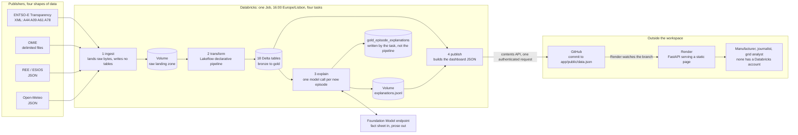
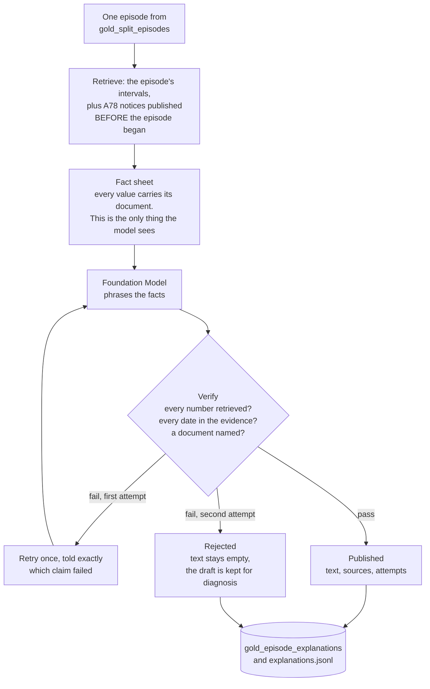

# Iberian Energy Capstone

MIBEL electricity market intelligence: detect market splitting between Portugal
and Spain, and explain why prices moved using grounded evidence.

Portugal and Spain share the MIBEL wholesale market and clear at the same price
whenever the interconnection has room. When it saturates, the zones decouple and
Portugal usually pays the premium. This project detects those episodes, prices
them, attributes them to named transmission assets, and produces an explanation
in prose where every figure is traceable to a published document.

- **[The live dashboard](https://iberian-energy.onrender.com)** is the output,
  with no sign in. It is rebuilt every afternoon by the scheduled Job.
- [GUIDE.md](GUIDE.md) is how to run it, locally and on Databricks.
- [ROADMAP.md](ROADMAP.md) is what is built, what is not, and what the numbers
  have been checked against.

## How it fits together

Four publishers, one Databricks Job, and a static page. Nothing the three
target users touch requires an account anywhere.



Two things in that picture are decisions rather than plumbing.

**The Job writes to GitHub rather than to a server.** A Databricks Job has no
git checkout and no ssh key, but it can make one authenticated HTTP request.
The contents API means one trigger and one credential, and Render watching the
branch means the commit is the deploy. If the data has not changed, nothing is
committed and nothing rebuilds.

**The explanations cross between tasks through the Volume, not the repository.**
Within one run the Git checkout is frozen at the commit the run started from, so
a file `explain` committed would be invisible to `publish` in the same run.

### The explanation layer

This is the part of the project that is not a dashboard. The model is handed
retrieved facts and nothing else, and what it writes is checked before anyone
reads it.



The guarantee is enforced after generation rather than requested in the prompt,
because a prompt is a request and this is meant to be a guarantee. Every figure
in the prose must match a value that came out of a document, every date must be
one the evidence supports, and at least one source must be named. An
explanation that fails is not softened, it is not shown.

## Why the code is shaped this way

The ingestion, parsing, analysis and agent modules are plain Python with no
Databricks imports. That is deliberate. It means the logic can be iterated on in
VS Code in seconds instead of on a cluster, it is unit testable, and the same
functions are called by the Lakeflow declarative pipeline without modification.
The pipeline file contains no transformation of its own: it wires tables to
functions the test suite already covers.

Bronze stores the raw API payload exactly as returned. Parsing happens on the
bronze to silver hop, so a parsing bug is fixed by replaying what has already
landed rather than by re-hitting a rate limited API. Sixty market days were
rebuilt from stored bytes without a single call to ENTSO-E.

The agent never sees market data. It is handed a fact sheet assembled in Python,
where every value carries the document it came from, and what it writes is
checked against that sheet before anyone reads it. A number that was not
retrieved is rejected, not softened.

The published page is built from the gold tables rather than querying them. The
same reason runs through the whole product: none of the three target users has a
Databricks account, so anything behind the workspace sign in cannot reach them.

## Layout

```
src/iberian/
  config.py                      EIC codes, document types, thresholds, settings
  market_time.py                 the Iberian market day, local midnight in CET
  ingestion/entsoe.py            API client, returns raw XML for bronze
  ingestion/border.py            A09 schedules and A61 capacity, both directions
  ingestion/omie.py              delimited day-ahead files, independent channel
  ingestion/esios.py             REE indicators: congestion rent, demand
  ingestion/open_meteo.py        hourly weather at six price relevant locations
  parsing/entsoe_prices.py       A44 XML -> tidy rows (handles sparse Points)
  parsing/entsoe_outages.py      A78/A80 curves, with point in time filtering
  analysis/market_splitting.py   decoupling detection + episode grouping
  analysis/interconnection.py    utilisation and saturation
  analysis/weather.py            within hour of day correlation
  analysis/validation.py         the two checks against outside publishers
  pipeline/gold.py               the three persona tables plus weather context
  pipeline/dedupe.py             which publication wins when a document repeats
  agent/facts.py                 retrieved evidence as named, sourced facts
  agent/verify.py                rejects any figure that was not retrieved
  agent/explain.py               generation loop with one corrected retry
  agent/batch.py                 explain only the episodes that have none yet
  agent/tracing.py               MLflow spans, or a no-op where MLflow is absent
  agent/experiment.py            one evaluation run: params, metrics, artifact
  agent/table.py                 the explanations as a table, typed and commented
  publish/dashboard.py           gold tables -> the published JSON, either source
  publish/github.py              commit a built file over the contents API
agents/
  mibel_agent.py                 the agent as an MLflow ResponsesAgent
pipelines/
  01_build_medallion.py          Databricks ingestion notebook, lands raw only
  02_explain_episodes.py         explain what is new, into the Volume
  03_publish_dashboard.py        gold -> JSON -> a commit, which Render deploys
  transformations/               the Lakeflow declarative pipeline, 18 tables
app/
  main.py                        FastAPI: the dashboard, and the OAuth flow
  public/index.html              the page itself, no framework, no build step
  public/data.json               published gold data, written by the Job
databricks.yml                   the Asset Bundle: variables and targets
resources/iberian_job.yml        the daily Job, four tasks, versioned
.github/workflows/ci.yml         tests and configuration checks on every push
scripts/
  build_medallion.py             local end to end run over a range of market days
  explore.py                     read the local tables without writing code
  explain_interval.py            the evidence behind one moment
  build_evaluation_set.py        the labelling sheet
  label_episodes.py              label episodes in the terminal
  explain_episodes.py            run the agent and report groundedness
  export_public_data.py          build the dashboard data from the local build
  check_bundle_paths.py          offline check that the bundle points at files
  check_hourly_shape.py          is the hourly concentration the sun or a fault
tests/                           synthetic data, no network, no credentials
data/raw/                        local stand in for the bronze landing zone
evaluation/                      labelling sheet, vocabulary, agent output
```

## Run it now, without credentials

```bash
pip install -r requirements.txt
python -m pytest tests/ -q
python scripts/run_market_splitting.py --demo
```

286 tests, under five seconds, no network and no credentials. The demo plants two
known splits in a synthetic week, so the output is verifiable by eye before real
data arrives.

## Run it with real data

1. Get an ENTSO-E security token and an ESIOS token (see below).
2. `cp .env.example .env` and fill them in.
3. ```bash
   export $(grep -v '^#' .env | xargs)
   python scripts/build_medallion.py --start 2026-08-01 --days 31
   python scripts/explore.py episodes
   ```

[GUIDE.md](GUIDE.md) covers the rest: exploring the tables, investigating a
single interval, running the same medallion on Databricks, the daily Job, the
labelling workflow, running the agent, and serving the dashboard.

### ENTSO-E token

1. Register at https://transparency.entsoe.eu and verify the email.
2. Email `transparency@entsoe.eu` with subject `RESTful API access` and your
   registered email address in the body. Access is granted within three
   working days.
3. Once granted, log in, go to **My Account**, and generate a token.

### ESIOS token

Request one from `consultasios@ree.es`. The token is personal to the account it
was issued to. REE's terms require that anything published reads from your own
server rather than from theirs, so a web front end must never call ESIOS
directly.

## How the deployed page stays current

One Job, four tasks, every afternoon at 16:00 Europe/Lisbon.

1. `ingest` calls the APIs and lands raw payloads in the Volume. It asks for a
   trailing three day window rather than one day, because ENTSO-E republishes
   corrected documents and landing a day twice is safe.
2. `transform` runs the declarative pipeline, which owns every table from bronze
   onwards and reads only what Auto Loader has not already seen.
3. `explain` generates an explanation for each episode that has none, two or
   three on a normal day. This is the task that makes the north star's "within
   fifteen minutes of publication" true of the system rather than of somebody
   being at a laptop. It writes to the Volume rather than to the repository,
   because within one run the Git checkout is frozen at the commit the run
   started from, so a file committed by this task would be invisible to the
   next one.
4. `publish` reads the gold tables, builds the dashboard JSON, and commits it
   over the GitHub contents API. Render watches the branch, so the commit is the
   deploy.

A Databricks Job has no git checkout and no ssh key, but it can make one
authenticated HTTP request, which is why the contents API is the mechanism: one
trigger, one credential, and no second deploy hook to keep in sync.

Nothing is committed when the data has not changed. The comparison ignores the
generated-at timestamp, so a quiet day leaves no commit and no rebuild.

The Job is defined in `resources/iberian_job.yml` and deployed with
`databricks bundle deploy -t prod`. Its tasks read their code from the branch
rather than from the bundle upload, so a `git push` is what changes the code
that runs, and the deploy only changes the Job definition.

## What the numbers have been checked against

Two of these compare against publishers that share no code with this project.
Both run as gold tables on every pipeline execution rather than as a script
somebody has to remember to invoke. The figures below are from the 60 market day
window, 2026-07-16 to 2026-09-13; the live dashboard carries the current ones.

**Prices, against OMIE.** ENTSO-E and OMIE publish the same settled day-ahead
prices through entirely separate channels. `gold_price_source_agreement`
compares them interval by interval and reports a disagreement rather than hiding
one. Across 5,760 intervals the two publishers agree on every single one, and
the largest difference is zero: not within the one cent tolerance, identical.

That is stronger evidence than it looks. The Iberian market day runs from local
midnight in CET rather than from UTC midnight, the day is 96 quarter hourly
intervals, and ENTSO-E omits repeated values from its XML. An error in any of
those would misalign the two series and show up here immediately.

Which OMIE column carries Portugal is decided by fitting both assignments and
taking the smaller error, because the file names neither column and the question
is only answerable on a day when the zones actually priced apart.

**Cost, against REE.** `gold_split_episodes.extra_cost_eur` is the premium
Portugal paid multiplied by the energy actually imported while the zones priced
apart, computed from ENTSO-E prices and schedules. REE publishes the congestion
rent on the same border, and `gold_cost_validation` compares them per market
day. Across those 60 market days:

| | |
|---|---|
| This project | 11,302,847 EUR |
| REE congestion rent | 11,303,022 EUR |
| Difference | -0.0015% |

Both series descend from the same market clearing, so this is a check on the
implementation rather than an independent measurement. It is still a demanding
one, and [ROADMAP.md](ROADMAP.md) explains why and accounts for the residual in
full.

**Explanations, against the retrieved evidence.** Every figure the agent writes
is matched against the set of values that were retrieved, and an explanation
that fails is never returned, and the dates it writes are checked against the
evidence too. Over all 48 labelled episodes, `databricks-claude-haiku-4-5`
produced 48 grounded explanations out of 48, 45 of them on the first attempt.
The three retries were all the same error: a day that was not the episode's,
which the retry corrected once it was told which date was wrong.

The honest reading of that is in [ROADMAP.md](ROADMAP.md), and it is less
flattering than the percentage. No model has invented a number in roughly a
hundred drafts, so the numeric check has never caught a real fabrication, and
every numeric rejection it has produced on live text was a defect in the check
itself. The date check is the one that has caught something real. Under the
same rules `databricks-claude-opus-4-5` also reaches 48 of 48, all on the first
attempt: the larger model never makes the date slip, the retry catches it for
the smaller one, and what reaches a reader is the same.

## What is not here yet

- Databricks Vector Search over the notice text. Retrieval today is a direct
  A78 query with the point in time filter applied in Python.
- The agent registered in Unity Catalog. It is wrapped as an MLflow
  `ResponsesAgent` in `agents/mibel_agent.py`, which is the interface Databricks
  currently recommends, but registering it needs `CREATE MODEL` on the schema.
- Deploying from CI. The tests and the configuration checks run on every push,
  but personal access tokens are disabled in this workspace and no service
  principal is available, so CI cannot authenticate to Databricks.
  `databricks bundle deploy -t prod` stays a deliberate manual step.
- Lakebase read models and the change feed back into Delta, blocked on the same
  authentication constraint (see [ROADMAP.md](ROADMAP.md)).
- Demand forecast error from the ESIOS series already in silver.
- REN Datahub for the Portuguese generation mix.

## Known gotchas already handled

Each of these cost time to find. They are recorded because the next person, or
the next me, will otherwise pay for them twice.

**Sparse Points.** ENTSO-E omits a `Point` when its value repeats the previous
one. Trusting `len(Points)` gives a short day and misaligns every timestamp
after the first gap. The parser forward fills to the count implied by the time
interval and resolution.

**Namespace versions.** The document namespace carries a version suffix that
changes between API revisions. The parser matches on local tag names instead of
hardcoding the namespace.

**Empty is not an error.** "No data for that window" comes back as an
`Acknowledgement_MarketDocument` with HTTP 200, not a 404.

**Episodes break on data gaps.** A missing hour ends an episode. Without that,
a data outage stitches two unrelated splits into one and the duration figure
becomes wrong in a way nobody notices.

**A landing zone is not a request.** The local build parses the responses it
just asked for, so it never sees an interval twice. A pipeline reading a Volume
does: overlapping backfills leave the same day in two documents, and the
duplicate guard refuses to pick one. `pipeline/dedupe.py` resolves it the way
the transparency platform does, with the later publication superseding the
earlier one.

**Spark hands back naive timestamps.** The market day is found by converting to
CET, which a timestamp with no timezone cannot do. `market_time.as_utc` restores
it at the one boundary where data leaves Spark. Localising wherever the data
happens to be read would be worse than the crash, because the market day begins
at local midnight and the wrong zone moves every boundary silently.

**Facts must come from one interval.** The fact sheet takes the prices, the
capacity and the flow from the single worst interval rather than a maximum here
and a minimum there. Mixing them produced evidence that could not be reconciled,
a spread that was not the difference of the two prices and a flow larger than
the capacity, and a model handed that writes something false through no fault of
its own.

**A verifier that rejects honest text is worse than none.** Three separate
false positives had to be fixed before the numeric check was usable: prose dates
("published on 25 June 2026"), the settlement interval length, and digits inside
a retrieved asset name (`AT 2 400/220 SRM`). Negative prices written with the
typographic minus sign were a fourth. Every one is now a test.

**`DATABRICKS_CLIENT_ID` and `DATABRICKS_CLIENT_SECRET` are reserved names.**
The Databricks SDK picks them up and attempts machine to machine auth, which
overrides the CLI profile and fails with `invalid_client`. The app's OAuth
credentials are therefore named `APP_OAUTH_CLIENT_ID` and
`APP_OAUTH_CLIENT_SECRET`.

**A Job with `git_source` does not read the workspace Git folder.** It takes its
own snapshot of the branch when the run begins, into
`/Workspace/Repos/.internal/<id>_commits/<sha>`. Pulling the Git folder of the
same repository changes nothing about what the Job runs, and three failed runs
were spent before the notebook was made to print its own repo root, which
settled the question in one line.

**A notebook is not a good place to invent a path.** `01_build_medallion`
already located `src/` from the checkout and worked. A second notebook that
solved the same problem differently failed twice before being changed to use the
block that was already proven in the same Job.

**A dependency that is only ever installed by accident.** `check_bundle_paths.py`
imports PyYAML, which was present on two machines as somebody else's transitive
dependency and absent in CI. It is declared now, and the clean environment is
what found it.