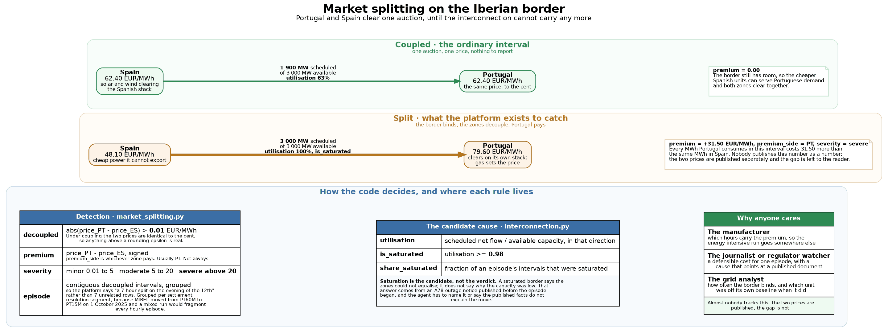
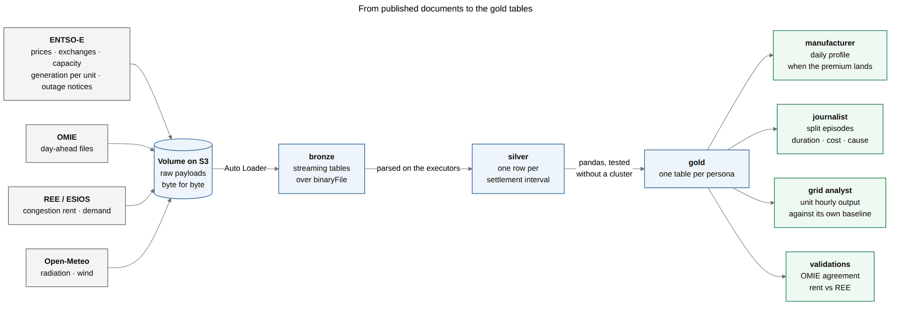
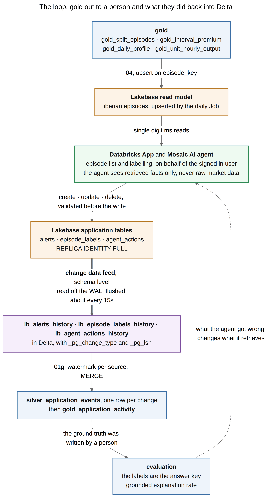
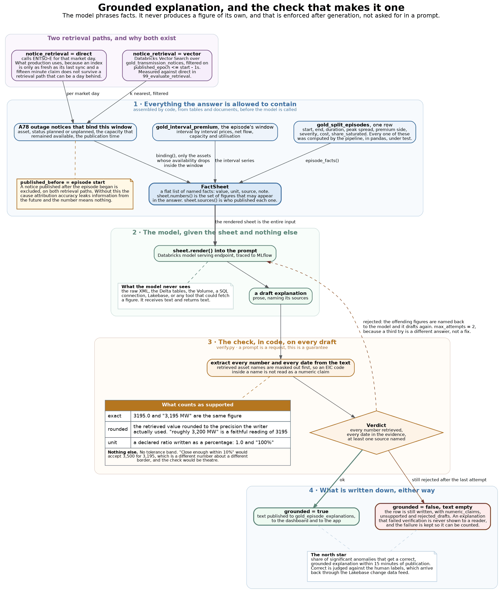
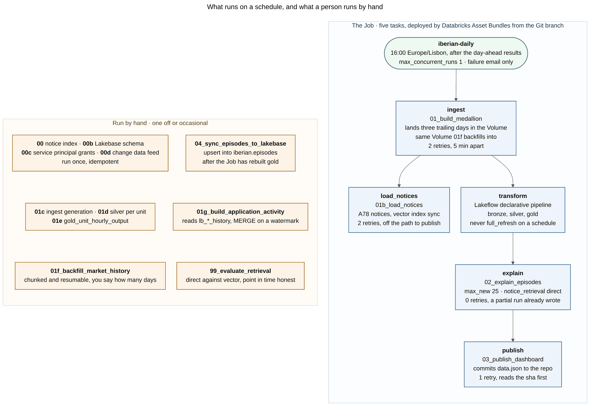

# Iberian Energy Capstone

MIBEL electricity market intelligence: detect market splitting between Portugal
and Spain, price it, attribute it to a named transmission asset, and explain it
in prose where every figure is traceable to a published document.

Portugal and Spain share the MIBEL wholesale market and clear at the same price
whenever the interconnection has room. When it saturates, the zones decouple and
Portugal usually pays the premium. The two prices are published. The gap between
them is not, and almost nobody tracks it.

- **[The dashboard](https://iberian-energy.onrender.com)** is the public output,
  with no sign in. Rebuilt every afternoon by the scheduled Job.
- **[The workbench](https://iberian-energy.onrender.com/workbench)** is the same
  data with an agent that can act: set an alert, label an episode, delete what
  it created. Those writes flow back into Delta and become the evaluation set.
- [GUIDE.md](GUIDE.md) is how to run it, locally and on Databricks.
- [ROADMAP.md](ROADMAP.md) is what is built, what is not, and what the numbers
  have been checked against.

## The thing being measured



Under coupling the two zones clear at the same price, to the cent. When the
border binds, Portugal clears on its own stack and every MWh it consumes in that
interval costs more than the same MWh in Spain. The thresholds in the lower band
are the constants the code uses, not illustrations: `DECOUPLING_EPSILON = 0.01`
in `src/iberian/config.py` and `SATURATION_THRESHOLD = 0.98` in
`src/iberian/analysis/interconnection.py`.

Saturation is the candidate cause, not the verdict. A full border says the zones
could not equalise. It does not say why the capacity was low, and that answer
has to come from a document published before the episode began.

## From published documents to the gold tables



Six publishers, one raw landing zone, and one table per question somebody
actually asks. Bronze stores the payload byte for byte, so a parsing bug is
fixed by replaying what has already landed rather than by re-hitting a rate
limited API. Parsing happens on the bronze to silver hop, on the executors,
using the same functions the test suite covers. Gold is computed in pandas,
which is why the analysis can be iterated on in seconds without a cluster.

Every Delta table, the layer it belongs to and the key each hop joins on is in
**[the lakehouse ER diagram](images_readme/04-lakehouse-er.png)**. It is dense;
open it full size rather than reading it inline.

## The loop that makes it a product and not a report



Gold reaches a person through a Lakebase read model and an application on
Render. What that person does there, an alert created, an episode labelled, a
tool call that was refused, is written to Lakebase application tables, streamed
back into Delta by the Lakebase change data feed, and turned into
`gold_application_activity`. The human labels that arrive on that path are the
ground truth the agent is evaluated against, so the loop closes: the product
produces the data that measures the product.

The four Postgres tables, their constraints and the one foreign key are in
**[the Lakebase ER diagram](images_readme/05-lakebase-er.png)**. Every table
carries `REPLICA IDENTITY FULL`, without which the change feed reports an update
with only the primary key and the analytics pipeline cannot see what changed.

## The explanation layer

This is the part of the project that is not a dashboard.



The model is handed a fact sheet assembled in Python, where every value carries
the document it came from, and nothing else. It has no SQL connection, no tool
that fetches a figure, and no sight of the raw data. What it writes is then
checked: every number must match a value that was retrieved, every date must be
one the evidence supports, and at least one source must be named.

The guarantee is enforced after generation rather than requested in the prompt,
because a prompt is a request and this is meant to be a guarantee. An
explanation that fails is not softened. It is not shown, the row is still
written with the offending claims recorded, and the failure is counted.

Notices are retrieved with `published_before = episode start` on both retrieval
paths. Without that filter the cause attribution accuracy leaks information from
the future and the number means nothing. `pipelines/99_evaluate_retrieval.py`
measures the leak by running the same retrieval with the filter and without it.

## What runs when



**Two Jobs, and they are triggered by different kinds of thing.**

`iberian-daily` runs six tasks at 16:00 Europe/Lisbon, which leaves margin after
the Iberian day-ahead results are published in the early afternoon. It runs on a
clock because the market publishes on a clock.

`iberian-activity` has one task and **no schedule at all**. It fires on a table
update trigger over the three `lb_*_history` tables, so a person labelling
episodes on a Tuesday evening sees the analytics catch up on a Tuesday evening,
and a day where nobody touched the application costs nothing.

What is left to a person is genuinely occasional and nothing downstream waits on
it: the one time setup, the two backfills, and the retrieval evaluation.

Three things in that picture are decisions rather than plumbing.

**The Job writes to GitHub rather than to a server.** A Databricks Job has no
git checkout and no ssh key, but it can make one authenticated HTTP request. The
contents API means one trigger and one credential, and Render watching the
branch means the commit is the deploy. If the data has not changed, nothing is
committed and nothing rebuilds.

**The explanations cross between tasks through the Volume, not the repository.**
Within one run the Git checkout is frozen at the commit the run started from, so
a file `explain` committed would be invisible to `publish` in the same run.

**The analytics are triggered by the data, not by a schedule and not by a
person.** An analytics pipeline that only produces numbers when somebody
remembers to produce them is a report, not a pipeline. The whole claim of this
architecture is that using the product generates the data that measures the
product, and a manual step in the middle of that sentence makes it false.

## Why the code is shaped this way

The ingestion, parsing, analysis and agent modules are plain Python with no
Databricks imports. That is deliberate. It means the logic can be iterated on in
VS Code in seconds instead of on a cluster, it is unit testable, and the same
functions are called by the Lakeflow declarative pipeline without modification.
The pipeline file contains no transformation of its own: it wires tables to
functions the test suite already covers.

`src/iberian/app/` is the one part that is allowed to import the Databricks SDK
and psycopg, and it is kept apart for the same reason in reverse. The web
service installs a much shorter requirements file than the pipeline does, and an
import reaching from there into the analysis modules would drag pandas into a
deploy that has no use for it.

The published page is built from the gold tables rather than querying them. The
same reason runs through the whole product: none of the three target users has a
Databricks account, so anything behind the workspace sign in cannot reach them.

## Layout

```
src/iberian/
  config.py                      EIC codes, document types, thresholds, settings
  market_time.py                 the Iberian market day, local midnight in CET
  ingestion/entsoe.py            API client, returns raw XML for bronze
  ingestion/border.py            A09 schedules and A61 capacity, both directions
  ingestion/omie.py              delimited day-ahead files, independent channel
  ingestion/esios.py             REE indicators: congestion rent, demand
  ingestion/open_meteo.py        hourly weather at six price relevant locations
  parsing/entsoe_prices.py       A44 XML -> tidy rows (handles sparse Points)
  parsing/entsoe_outages.py      A78/A80 curves, with point in time filtering
  parsing/entsoe_generation.py   A73 per unit output, generation and consumption
  analysis/market_splitting.py   decoupling detection + episode grouping
  analysis/interconnection.py    utilisation and saturation
  analysis/capacity.py           where a capacity sits among the others
  analysis/generation_baseline.py  a unit against its own 30 day median
  analysis/weather.py            within hour of day correlation
  analysis/validation.py         the two checks against outside publishers
  pipeline/gold.py               the persona tables plus weather context
  pipeline/dedupe.py             which publication wins when a document repeats
  agent/facts.py                 retrieved evidence as named, sourced facts
  agent/verify.py                rejects any figure that was not retrieved
  agent/explain.py               generation loop with one corrected retry
  agent/batch.py                 explain only the episodes that have none yet
  agent/retrieval.py             the same evidence, out of the vector index
  agent/notices.py               A78 notices as table rows and as searchable text
  agent/tracing.py               MLflow spans, or a no-op where MLflow is absent
  agent/experiment.py            one evaluation run: params, metrics, artifact
  agent/table.py                 the explanations as a table, typed and commented
  app/lakebase.py                a fresh 60 minute credential per connection
  app/workspace.py               which identity this process acts as
  app/session.py                 who the visitor says they are, in a signed cookie
  app/actions.py                 the writes the agent may make, validated first
  app/assistant.py               the tool calling agent behind the workbench
  app/limits.py                  what this application will spend, and on whom
  publish/dashboard.py           gold tables -> the published JSON, either source
  publish/github.py              commit a built file over the contents API
agents/
  mibel_agent.py                 the explanation agent as an MLflow ResponsesAgent
pipelines/
  00_setup_notice_index.py       one off: the notice table and its vector index
  00b_apply_lakebase_schema.py   one off: sql/001 applied to Lakebase
  00c_grant_service_principal.py one off: the app's Postgres role and grants
  00d_enable_lakebase_cdf.py     one off: the change data feed, immutable once made
  01_build_medallion.py          ingest task: APIs to the Volume, no tables
  01b_load_notices.py            A78 notices to Delta, and the index sync
  01c_ingest_generation.py       by hand: a year of A73 per unit documents
  01d_build_generation_silver.py by hand: silver_generation_per_unit
  01e_build_generation_gold.py   by hand: gold_unit_hourly_output, with baselines
  01f_backfill_market_history.py by hand: N days of market history, resumable
  01g_build_application_activity.py  activity Job: lb_*_history -> silver -> gold
  02_explain_episodes.py         explain task: new episodes to the Volume
  03_publish_dashboard.py        publish task: gold -> JSON -> a commit
  04_sync_episodes_to_lakebase.py  sync task: gold_split_episodes -> iberian.episodes
  99_evaluate_retrieval.py       direct against vector, and the leak measured
  transformations/               the Lakeflow declarative pipeline
app/
  main.py                        FastAPI: the dashboard and the OAuth flow
  api.py                         the workbench routes: episodes, alerts, labels, ask
  public/index.html              the dashboard, no framework, no build step
  public/workbench.html          the workbench
  public/data.json               published gold data, written by the Job
sql/
  001_application_tables.sql     the four Lakebase tables, idempotent
  002_service_principal_grants.sql  what the application's role may do
images_readme/                   the figures above, with their editable sources
databricks.yml                   the Asset Bundle: variables and targets
resources/iberian_job.yml        the daily Job, six tasks, versioned
resources/iberian_activity_job.yml  the activity Job, triggered by table update
.github/workflows/ci.yml         tests and configuration checks on every push
scripts/                         local entry points, see GUIDE.md
tests/                           synthetic data, no network, no credentials
data/raw/                        local stand in for the bronze landing zone
evaluation/                      labelling sheet, vocabulary, agent output
```

## Run it now, without credentials

```bash
pip install -r requirements.txt
python -m pytest tests/ -q
python scripts/run_market_splitting.py --demo
```

541 tests, about fifteen seconds, no network and no credentials. The demo plants
two known splits in a synthetic week, so the output is verifiable by eye before
real data arrives.

## Run it with real data

1. Get an ENTSO-E security token and an ESIOS token (see below).
2. `cp .env.example .env` and fill them in.
3. ```bash
   export $(grep -v '^#' .env | xargs)
   python scripts/build_medallion.py --start 2026-08-01 --days 31
   python scripts/explore.py episodes
   ```

[GUIDE.md](GUIDE.md) covers the rest: exploring the tables, investigating a
single interval, running the same medallion on Databricks, the daily Job, the
Lakebase half, the workbench, the labelling workflow, running the agent, and
serving the dashboard.

### ENTSO-E token

1. Register at https://transparency.entsoe.eu and verify the email.
2. Email `transparency@entsoe.eu` with subject `RESTful API access` and your
   registered email address in the body. Access is granted within three
   working days.
3. Once granted, log in, go to **My Account**, and generate a token.

### ESIOS token

Request one from `consultasios@ree.es`. The token is personal to the account it
was issued to. REE's terms require that anything published reads from your own
server rather than from theirs, so a web front end must never call ESIOS
directly.

## What the numbers have been checked against

Three of these compare against publishers or people outside this project. All
three of the first run as gold tables on every pipeline execution rather than as
a script somebody has to remember to invoke, so a disagreement appears as a row
rather than as a forgotten check.

**Prices, against OMIE.** ENTSO-E and OMIE publish the same settled day-ahead
prices through entirely separate channels. `gold_price_source_agreement`
compares them interval by interval and reports a disagreement rather than hiding
one. The two publishers agree on every interval compared, and the largest
difference is zero: not within the one cent tolerance, identical.

That is stronger evidence than it looks. The Iberian market day runs from local
midnight in CET rather than from UTC midnight, the settlement resolution changed
from PT60M to PT15M on 1 October 2025, and ENTSO-E omits repeated values from
its XML. An error in any of those would misalign the two series and show up here
immediately.

Which OMIE column carries Portugal is decided by fitting both assignments and
taking the smaller error, because the file names neither column and the question
is only answerable on a day when the zones actually priced apart.

**Cost, against REE.** `gold_split_episodes.congestion_rent_eur` is the spread
multiplied by the energy that crossed the border while the zones priced apart,
computed from ENTSO-E prices and schedules. REE publishes the congestion rent on
the same border as ESIOS indicator 599, and `gold_cost_validation` compares them
per market day. Over 367 market days this project totals 27,720,655 EUR against
REE's 27,721,890 EUR, a difference of **-0.0045%**.

The comparison is rent against rent, and that took a correction. An earlier
version compared REE's rent to `extra_cost_eur`, which counts the import
direction only. The two agreed to 0.0015% over a 70 day summer window because
the flow was one directional throughout it, and diverged to 21% once a year of
data included days flowing the other way. Both quantities are now carried:
`congestion_rent_eur` for the comparison and `extra_cost_eur` for what Portugal
actually paid. [ROADMAP.md](ROADMAP.md) has the full account.

**Explanations, against the retrieved evidence.** Every figure the agent writes
is matched against the set of values that were retrieved, every date is checked
against the evidence, and an explanation that fails is never returned. Over the
48 labelled episodes, `databricks-claude-haiku-4-5` produced 48 grounded
explanations out of 48, 45 of them on the first attempt. The three retries were
all the same error, a day that was not the episode's, which the retry corrected
once it was told which date was wrong.

The honest reading is in [ROADMAP.md](ROADMAP.md) and it is less flattering than
the percentage. No model has invented a number in roughly a hundred drafts, so
the numeric check has never caught a real fabrication, and every numeric
rejection it has produced on live text was a defect in the check itself. The
date check is the one that has caught something real. Under the same rules
`databricks-claude-opus-4-5` also reaches 48 of 48, all on the first attempt:
the larger model never makes the date slip, the retry catches it for the smaller
one, and what reaches a reader is the same.

**Retrieval, against itself with the filter turned off.** Both retrieval paths
were asked the same question for all 377 episodes that carry an explanation:
which transmission asset was tightest, and at what capacity. They agree on
**375 of 377**. The same retrieval was then run with the publication filter and
without it, and both results checked for notices published after the episode
began:

| | |
|---|---|
| Future notices retrieved **with** the filter | **0** |
| Future notices retrieved **without** it | **1,151**, across 277 of the 377 episodes |

The second row is the one that matters. A zero on its own would be worthless,
because a filter that excludes nothing also reports zero. Nearly three quarters
of the episodes had at least one notice published after they began that would
otherwise have been retrieved as evidence, so the filter is excluding something
real. Every episode is kept in `gold_retrieval_evaluation`, so the figure is one
somebody else can re-run the query for rather than one quoted from a slide.

**Generation, against a unit's own history.** `gold_unit_hourly_output` compares
every unit hour against the median of the same local hour over the 30 prior
days. Vandellos II, a Spanish nuclear station, appears at 0 MW against a
1,042.4 MW baseline for several consecutive days in March 2026, which is a real
refuelling outage found without being told what to look for. The flag is called
`looks_offline` and not `is_offline` on purpose: it does not distinguish a
forced outage from a plant that simply was not dispatched, and the agent has to
corroborate it against a published notice before attributing anything to it.

## What is not here

- **Demand forecast error.** The ESIOS series are landed, parsed and in silver.
  The analysis is not written. It is the missing half of the grid analyst.
- **REN Datahub** for the Portuguese generation mix, and REN or ERSE
  announcements as a second unstructured source. A78 notices partly cover the
  second.
- **The explanation agent behind a serving endpoint.** It is registered in Unity
  Catalog as `bootcamp_students.doriel.mibel_agent`, but not deployed: the daily
  Job calls the same code directly, and an endpoint would cost money to run for
  no user. The workbench agent is a different thing and is deployed, on Render.
- **Deploying from CI.** The tests and the configuration checks run on every
  push, but personal access tokens are disabled in this workspace, so CI cannot
  authenticate to Databricks. `databricks bundle deploy -t prod` stays a
  deliberate manual step, and it changes only the Job definition: the code the
  Job runs comes from the branch.
- **A price forecasting model.** Out of scope by an early decision and the
  decision still holds. It is hard to beat naive baselines and it distracts from
  the explanation layer, which is the part of this project nobody else has.

## Known gotchas already handled

Each of these cost time to find. They are recorded because the next person, or
the next me, will otherwise pay for them twice.

**A unit publishes generation and consumption as two TimeSeries.** Both
positive, both `businessType A01`, distinguished only by
`inBiddingZone_Domain.mRID` against `outBiddingZone_Domain.mRID`. Missing that
produced 39,061 false duplicate keys on the first build of
`silver_generation_per_unit`. It is not only pumped storage: a CCGT and a run of
river station both publish their own station consumption. Any aggregate over
output has to filter `flow_direction = 'generation'`.

**`inBiddingZone_Domain.mRID` contains a dot, and ElementTree gives a dot its
own meaning in a path.** `find('{ns}inBiddingZone_Domain.mRID')` silently
matches nothing and returns `None`, which is how the bug above survived a
review. The parser scans direct children by local name instead.

**`curveType` A03 is a variable sized block.** A published point holds until the
next position, and the last holds to the period end. A stopped plant publishes
one zero, not a run of zeros, so only 3% of offline hours carry a zero published
in that hour. Silver keeps published points; gold expands the blocks.

**Sparse Points.** ENTSO-E omits a `Point` when its value repeats the previous
one. Trusting `len(Points)` gives a short day and misaligns every timestamp
after the first gap. The parser forward fills to the count implied by the time
interval and resolution.

**The settlement resolution changed mid history.** MIBEL moved from PT60M to
PT15M on 1 October 2025. Episode grouping runs per resolution segment, because a
single run over mixed resolutions fragments every hourly episode into quarters
and every duration comes out wrong. The step is a lookup from the stated
resolution, never inferred, because an inferred step is the mode of the year and
is wrong on one side of the change.

**Namespace versions.** The document namespace carries a version suffix that
changes between API revisions. The parser matches on local tag names instead of
hardcoding the namespace.

**Empty is not an error.** "No data for that window" comes back as an
`Acknowledgement_MarketDocument` with HTTP 200, not a 404.

**ENTSO-E returns a ZIP once a response holds more than one document.** The
pipeline filters the landing folders with `*.xml`, so an archive landed there
would be invisible and silently never ingested. The backfill expands archives on
the way in.

**A backfill file must never overwrite a Job file.** Auto Loader tracks files by
path, so an overwritten file is one it has already seen and will never read
again. Backfill filenames carry the chunk length for this reason.

**Episodes break on data gaps.** A missing hour ends an episode. Without that, a
data outage stitches two unrelated splits into one and the duration figure
becomes wrong in a way nobody notices.

**A landing zone is not a request.** The local build parses the responses it
just asked for, so it never sees an interval twice. A pipeline reading a Volume
does: overlapping backfills leave the same day in two documents.
`pipeline/dedupe.py` resolves it the way the transparency platform does, with
the later publication superseding the earlier one.

**Spark hands back naive timestamps.** The market day is found by converting to
CET, which a timestamp with no timezone cannot do. `market_time.as_utc` restores
it at the one boundary where data leaves Spark.

**Facts must come from one interval.** The fact sheet takes the prices, the
capacity and the flow from the single worst interval rather than a maximum here
and a minimum there. Mixing them produced evidence that could not be reconciled,
a spread that was not the difference of the two prices and a flow larger than
the capacity, and a model handed that writes something false through no fault of
its own.

**A verifier that rejects honest text is worse than none.** Five separate false
positives had to be fixed before the numeric check was usable: prose dates, the
settlement interval length, digits inside a retrieved asset name
(`AT 2 400/220 SRM`), the typographic minus sign, and unit conversions. Every
one is now a test, and [ROADMAP.md](ROADMAP.md) keeps the full record because
the pattern is the finding.

**`DATABRICKS_CLIENT_ID` and `DATABRICKS_CLIENT_SECRET` are reserved names.**
The Databricks SDK picks them up and attempts machine to machine auth, which
overrides the CLI profile and fails with `invalid_client`. The application's
user facing OAuth credentials are therefore named `APP_OAUTH_CLIENT_ID` and
`APP_OAUTH_CLIENT_SECRET`, and the two pairs must never share values.

**Lakebase has two names for one database.** The resource id is
`databricks-postgres` with a hyphen and the Postgres database name is
`databricks_postgres` with an underscore. The same distinction makes a service
principal's `role_id` different from its Postgres role name.

**Use the endpoint's own host, never the `-pooler` host.** The pooler endpoint
fails with `SASL authentication failed` against a generated database credential.

**Lakebase change data feed is schema level and immutable once created.** There
is no per table toggle and no edit. Getting the destination catalog wrong means
creating a new configuration, so `00d` checks the catalog's storage location and
the replica identity of every table before it creates anything.

**`foreachBatch` streaming kills the Spark Connect session on serverless.** The
first version of `01g` failed with `INTERNAL_ERROR: Spark session is no longer
usable`. It is a watermark and a `MERGE` now, which is also incremental without
needing a checkpoint to be intact.

**A Job with `git_source` does not read the workspace Git folder.** It takes its
own snapshot of the branch when the run begins, into
`/Workspace/Repos/.internal/<id>_commits/<sha>`. Pulling the Git folder of the
same repository changes nothing about what the Job runs, and three failed runs
were spent before the notebook was made to print its own repo root, which
settled the question in one line.

**A notebook is not a good place to invent a path.** `01_build_medallion`
already located `src/` from the checkout and worked. A second notebook that
solved the same problem differently failed twice before being changed to use the
block that was already proven in the same Job.

**A dependency that is only ever installed by accident.** `check_bundle_paths.py`
imports PyYAML, which was present on two machines as somebody else's transitive
dependency and absent in CI. It is declared now, and the clean environment is
what found it.